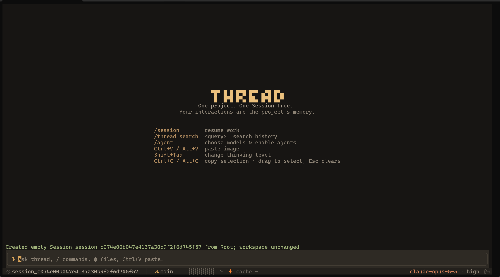
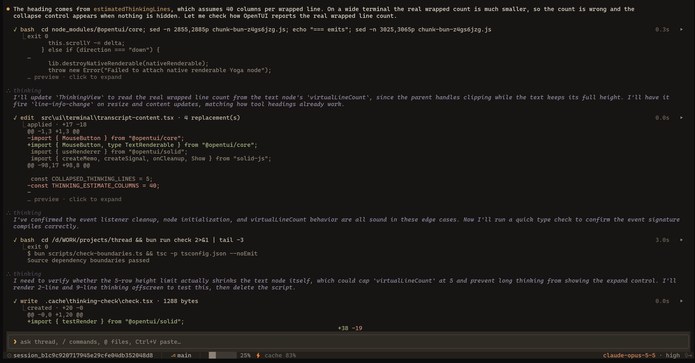

<div align="center">

# Thread

**Thread helps coding agents remember an entire project, then resume, revisit, and move the work forward at any time.**

[简体中文](./README.zh-CN.md) · [Releases](https://github.com/non-convex/thread/releases) · [Development](#development)

[](https://github.com/non-convex/thread/actions/workflows/ci.yml)
[](https://bun.sh)
[](./LICENSE)

</div>

Thread is a coding-agent runtime for work that should outlast a single chat. Inside a project, one persistent Session Tree turns every interaction and execution into history you can resume, rewind, search, and recall. Across projects, a small global memory carries only the stable facts that should travel with you.

The design follows three rules: stay small and add no entity without need; manage and compact context carefully to preserve cache hits; and admit only information that must enter context so the window does not grow too quickly.

## Interface



<p align="center"><em>Open a project directly into its persistent Session Tree.</em></p>



<p align="center"><em>Thinking, tool activity, elapsed time, context usage, model, and thinking level in one view.</em></p>

## Quick start

### Requirements

- A [standalone release](https://github.com/non-convex/thread/releases), or Bun 1.3.14+ when running from source
- A model provider or ChatGPT subscription login
- [ripgrep](https://github.com/BurntSushi/ripgrep) (`rg`) for the built-in code-search tool

Git is optional. Thread can open any existing directory as a project.

### Run a release build

Download the archive for your platform, extract it, and put `thread` (or `thread.exe`) on your `PATH`:

```bash
thread --root /path/to/project
```

Use `--tui plain` to force plain mode.

### Run from source

```bash
git clone https://github.com/non-convex/thread.git
cd thread
bun install
bun run dev --root /path/to/project
```

When running from source, replace the `thread` executable in later examples with `bun run dev`.

### Connect a model

ChatGPT subscribers can use the built-in `openai-codex` OAuth provider:

```bash
thread login openai-codex
thread auth status
thread --root /path/to/project
```

Run `/model all` inside the TUI to choose an available model, or select one at startup:

```bash
thread --root /path/to/project --provider openai-codex --model <model-id>
```

Thread stores this login separately from Codex CLI in `~/.thread/auth.json` (or `$THREAD_HOME/auth.json`). Treat it like a password. Remove it with `thread logout openai-codex`.

Built-in model metadata can be overridden in `~/.thread/config.json` without replacing its provider or authentication. For example, `"modelOverrides": { "openai-codex/gpt-5.6-sol": { "contextWindow": 500000 } }` changes Thread's local context budgeting, display, and compaction threshold. It cannot raise a limit enforced by the provider. When Thread falls back to `~/.pi/agent/models.json`, it also reads pi's nested `providers.<provider>.modelOverrides` format.

For an API key or compatible relay, copy [`thread.config.example.json`](./thread.config.example.json) to `~/.thread/config.json`, edit the provider and model, and set the environment variable named by `apiKeyEnv`. Custom providers can use `openai-responses`, `openai-completions`, or `anthropic-messages`.

## How it works

### Sessions are paths through one history

A project owns one virtual Root and any number of top-level Sessions. A Session is not a copy of the workspace; it is an independent path through project history.

```text
Project
├── Current workspace
└── Persistent Session Tree
    ├── Session A: Turn 1 → Turn 2 → Turn 3
    │                            └────→ Turn 3′ after rewind
    └── Session B: independent context created by /new
```

- `/new` creates and activates an empty Session without copying messages, calling the model, summarizing history, or changing files.
- `/session` lists Sessions.
- `/session <id>` resumes one at its saved live tip, again without changing files.

The model normally sees only the active Session's live path. Everything else remains in project memory and can be recalled when needed.

### Turns connect interaction, execution, and workspace state

Each turn records the user message, assistant output, tool execution facts and results, parent turn, final status, and a workspace-state ID. The workspace state is the checkpoint before that user turn.

Thread captures the next checkpoint when a turn ends and reuses it for the next send. The first turn in a process performs a bootstrap scan. Interrupted and failed turns are sealed into valid conversation prefixes and remain the live tip, so the next request can continue from factual history.

Worker execution traces are kept in the same project's Agent Task journal rather than injected into the parent context. The parent receives compact task results and reviews the shared workspace directly.

### Rewind creates a branch

`/rewind` lists user turns on the active live path. Selecting one:

1. verifies and restores its pre-turn workspace checkpoint;
2. moves the Session live tip to the turn's parent;
3. rebuilds context from that path; and
4. keeps the selected turn and all later turns in history.

The next message creates a new child path. Missing or corrupt state fails before the live tip moves.

A checkpoint comes from the previous completed turn. Manual edits made after that checkpoint while Thread is idle are not part of the next turn's pre-turn state.

### Search and recall

`session_search` searches every Session and historical branch. `session_read` retrieves one matching turn or a bounded path around it. Recalled information can be stale, so the agent is instructed to check current files whenever correctness depends on it. The model does not yet see the whole tree by default; whole-tree awareness is planned.

## Context policy

- Normal requests contain the active live path; off-path history enters only through explicit recall.
- Skills are loaded once into a stable system-prompt prefix.
- `${THREAD_HOME}/.THREAD.md` is loaded as a fixed per-Session global-memory snapshot after the system prompt. `/new` reloads it for the new Session.
- Compaction happens only at complete model-step boundaries and is stored as another append-only tree entry.
- A compaction pass proceeds only when its estimated context benefit is material.
- Finer-grained admission is still planned.

`/compact` requests a manual pass. Automatic compaction runs when context reaches 78% or a provider reports overflow. A pass keeps at least the newest five complete steps and expands the retained working set while its roughly 20K-token budget allows. Earlier history remains available to rewind, search, and recall.

## Agents and global memory

`/agent` is the common entry point for model selection and agent settings. Thread has three built-in profiles: `main`, `implementation-worker`, and `dreamer`. The secondary agents start disabled and require an explicit model selection.

Global memory is the single Markdown file `${THREAD_HOME}/.THREAD.md`. Its contents do not enter the Session Tree, search, rewind, or compaction. The main agent may update only that exact external file when the current user message explicitly contains stable, cross-project information. Each Session keeps the snapshot captured when it began; disk changes become visible after `/new` or restart.

Dreamer is an optional background memory curator. Enable it with `/agent dreamer model <provider>/<model>`. It reviews conversational evidence after a successful compaction, or after ten settled turns followed by ten idle minutes. It uses only `read`, `write`, and `edit`, runs one instance at a time, and stays silent on success.

## Implementation workers

Implementation workers start disabled. Run `/agent implementation-worker model <provider>/<model>` to select a model and enable them. The main agent can then delegate one or two independent leaf tasks with non-overlapping `writeScope` values.

Workers edit the current project directly. There is no private clone or apply step, and `writeScope` is a coordination boundary rather than a filesystem sandbox. The main agent reviews the files and tests; completed workers can receive revision feedback in the same context.

Workers belong to their parent turn. Finishing or interrupting the turn, closing Thread, or restarting cancels unfinished tasks while preserving files already written. Use `/rewind` to restore the whole workspace. See [the subagent architecture](./docs/subagent-architecture.md) for details.

## Commands

| Command | Purpose |
| --- | --- |
| `thread login <provider>` | Start a supported subscription login. |
| `thread logout <provider>` | Remove a provider credential. |
| `thread auth status` | Show subscription authentication status. |
| `/new` | Create an empty Session; keep workspace files unchanged. |
| `/session [<session-id>]` | List Sessions or resume one. |
| `/rewind [<turn-id-or-user-entry-id>]` | Choose or directly restore a pre-turn checkpoint. |
| `/compact` | Compact the active live context. |
| `/model [all\|list [provider]\|<provider>/<model>]` | Inspect or select the main model. |
| `/agent` | Choose an agent, then configure it. |
| `/agent <id> [on\|off]` | Open settings or toggle a secondary agent. |
| `/agent <id> model [all\|list [provider]\|<provider>/<model>]` | Inspect or select an agent model. |
| `/skill [<name> [extra instruction]]` | List or invoke a loaded skill. |
| `/thread status` | Show project and active-tree status. |
| `/thread sessions` | List Sessions and saved live tips. |
| `/thread open <session-id>` | Resume a Session without changing files. |
| `/thread history` | Browse turns across the whole tree. |
| `/thread search <query> [<query> ...]` | Search all Sessions and branches. |
| `/clear` | Clear the visible transcript. |
| `/exit` | Exit Thread. |

In the full-screen TUI, `Shift+Tab` cycles supported thinking levels, `Ctrl+V` (or `Alt+V` when the terminal intercepts Ctrl+V) attaches a clipboard image for vision models, and `Esc` interrupts the active turn.

## Configuration and storage

Thread reads `~/.thread/config.json` by default and falls back to compatible settings under `~/.pi/agent` when that file is absent. Main-model selection priority is:

```text
--provider/--model or THREAD_PROVIDER/THREAD_MODEL
→ remembered choice in ~/.thread/state.json
→ model in ~/.thread/config.json
```

`THREAD_HOME` changes the state directory and `THREAD_CONFIG` selects another config file. Main-model, thinking-level, and secondary-agent choices are remembered in `~/.thread/state.json`.

Project state lives outside the workspace:

```text
~/.thread/projects/<project-id>/
├── project.json
├── session-tree/{tree.json,events.jsonl}
├── workspace-states/{states,blobs}
└── agent-tasks/events.jsonl
```

Session Tree and Agent Task records are independent append-only logs. Workspace states are content-addressed. Checkpoints exclude Thread metadata and common generated directories such as `.git`, `.thread`, `node_modules`, `dist`, `build`, `coverage`, `target`, virtual environments, and framework caches.

`/rewind` never restores excluded paths, paths outside the project, processes, databases, network effects, or other external state. Thread does not implement general-purpose version control.

## Development

```bash
bun run check
bun test test --timeout 30000
bun run build
```

Main code boundaries:

```text
src/session-tree/     persistent project history, paths, search, and recall
src/workspace-state/  checkpoint capture, verification, restore, and GC
src/context/          live-path projection and compaction
src/agent/            model steps, tool scheduling, journals, and turns
src/agent-task/       shared-workspace worker lifecycle and task journal
src/dreamer/          background global-memory curation and scheduling
src/app/              runtime composition and input routing
src/tools/            built-in agent tools and execution policies
src/ui/               plain and full-screen terminal interfaces
```

Thread also exports its runtime, stores, model catalog, tools, commands, skills loader, extension API, and UI types for embedding. See [`src/index.ts`](./src/index.ts).

Further reading:

- [Subagent architecture](./docs/subagent-architecture.md)
- [Global memory and Dreamer architecture](./docs/global-memory-architecture.md)
- [Full-screen TUI](./docs/tui.md) (Chinese)
- [Pasting clipboard images into the TUI](./docs/tui-image-paste.md) (Chinese)
- [Designing grep output for an agent's context window](./docs/grep.md) (Chinese)

## License

[MIT](./LICENSE)
