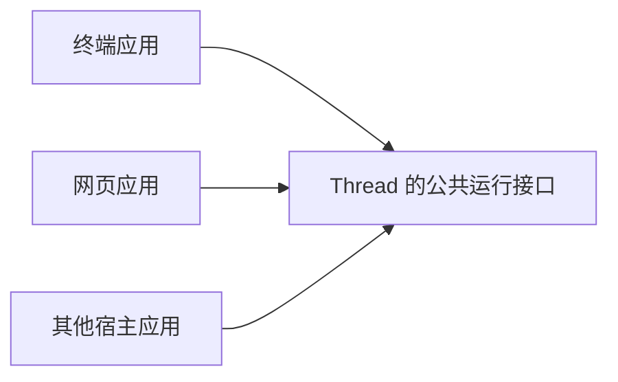
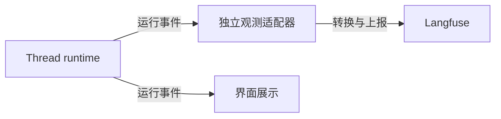

# 让系统容易扩展：从 Thread 出发，理解软件架构的基本思路

假设今天的 Thread 已经能在终端里帮你写代码。

过了一段时间，你想给它做一个网页界面。后来，你又希望另一个应用能使用它的 agent 能力。再后来，你想接入一个观测平台，看看模型为什么反复调用工具、一次任务花了多少时间。

这些需求都很自然。一个真正被使用的系统，往往就是这样慢慢长大的。

如果每增加一个需求，都要深入 agent 的主循环，修改一批原本正常工作的代码，开发者就会越来越不敢动它。你想解决的，正是这个问题：**怎样安排系统内部的关系，让新的变化容易加入，又不至于牵动所有地方。**

这属于软件架构的基本问题。

我们先从一个小程序讲起。等遇到具体困难，再引入模块、接口、事件、扩展这些概念。这样，你会知道每个概念是在解决什么问题，也更容易判断它是否有必要。

文中的 Thread 指本仓库的 agent 项目。你不需要熟悉 TypeScript；代码只用来帮助理解，关键处都会用文字解释。涉及当前实现的内容会明确指出，设想中的外部观测适配器则会标为设计示意。

文章稍长，可以分三次阅读：

- 第 1—6 节：先理解怎样安排职责、依赖和接口。
- 第 7—14 节：再理解各部分怎样交流，以及运行中的时间和状态问题。
- 第 15—17 节：把这些概念放回 Thread，并学习怎样判断一个设计是否过度。

第一次阅读不用记住全部名词。能理解每个安排解决了什么困难，就已经抓住了重点。

---

## 1. 一个能工作的程序，也可能越来越难修改

刚开始做一个 coding agent 时，把事情写在一起很方便。

收到用户输入，调用模型。模型要读文件，就读文件。模型返回文字，就把文字打印到终端。做完之后，把会话保存起来。

整个过程可以想象成下面这样。它只是帮助理解的伪代码：

```text
处理用户输入：
    准备模型上下文
    调用模型
    执行模型要求的工具
    把结果打印到终端
    保存会话
```

在只有一种使用方式的时候，这样做未必有问题。它直观、容易启动，也容易看出整个流程。

困难是在需求变化之后出现的。

现在你想做 Web UI。网页需要把内容发送给浏览器，原来的代码却直接把内容打印到终端。于是你在主循环里加判断：如果是终端，就打印；如果是网页，就发给浏览器。

接着，又有一个应用想把 Thread 嵌入自己的后端。这个应用既不需要终端，也不需要 Thread 的网页界面，只想取得运行结果。主循环里又多了一种分支。

如果这时候再接入 Langfuse，很容易继续沿用相同做法：在模型调用之后，加一段 Langfuse 上报代码。

问题并不在于某个 `if` 写错了。问题在于，**agent 的执行过程开始同时承担界面展示、宿主适配和平台上报的责任。**

以后，网页协议变化可能要修改它；观测平台升级可能要修改它；增加工具也要修改它。几个本来不同的变化，挤在了同一个地方。

理解架构，可以先建立一个很朴素的观察习惯：每次新增需求时，看看它迫使你修改了哪些原本不该关心这件事的代码。

这比先数项目里有多少个类、多少层目录，更能说明问题。

## 2. 先把不同原因引起的变化分开

我们重新看刚才的程序。

“怎样让模型与工具轮流工作”，和“怎样把结果画到终端上”，会因为不同的原因而变化。

前者可能因为模型协议、工具调度、取消规则而变化。后者可能因为布局、颜色、键盘交互而变化。

把这两部分分开之后，你就可以调整终端界面，而不必同时理解模型循环。

这就是划分**职责**的起点。

职责可以理解成一项明确的责任。例如，工具执行部分负责让工具在正确的条件下运行；界面负责把运行情况解释给用户。职责决定了一个部分应该知道什么，也决定了它不必知道什么。

承担一组相关职责的代码，我们通常称为一个**模块**。模块可以是一个文件、一组文件，也可以是一个独立的包。这个词并没有要求你使用某一种语言结构。

不过，只是把一个长文件剪成几个短文件，还不一定真正分开了职责。

假设终端模块虽然独立成了文件，却仍然直接修改 agent 内部的工具队列。这样一来，工具队列一调整，终端模块也必须跟着调整。文件分开了，两者之间的牵连仍然存在。

所以，分模块之后，还要给模块之间画出**边界**。

边界的意思是：哪些东西允许外部使用，哪些东西由模块自己管理。外部想使用某项能力，应当从什么入口进入。

对 Thread 来说，“宿主通过 `thread/runtime` 使用能力，核心实现留在 `src/core/`”就是一条边界。目录能帮助人看见这条边界，真正维持边界的，是代码有没有绕过入口去使用内部细节。

一个实用的划分方法是：把经常需要一起修改的内容放近一些，把因为不同原因变化的内容分开一些。

这个判断需要随着项目成长而调整。第一版不必一次划分到位。

## 3. 依赖关系决定了变化会传到哪里

现在我们有了核心和界面。下一步要看它们怎样联系。

如果界面要调用核心的某个方法，那么界面就必须知道这个方法存在。我们说：界面**依赖**核心提供的接口。

如果核心又直接调用终端组件，核心也依赖界面。

这种相互依赖很容易让事情变复杂。你想单独使用核心，却发现它会加载终端组件；你想替换终端，却发现核心里到处引用旧终端的类型。

一个更方便嵌入的安排，是让使用者依赖核心的公开能力。下面的箭头表示“需要知道对方的接口”，不表示数据只能沿这个方向流动。



核心仍然会把运行情况传回界面。只是它不用为此认识某个具体的终端组件或网页框架。

这里有一个很重要的区别：**运行时有数据来往，不等于源代码必须互相依赖。**

比如，界面可以把一个“收到新文字后要做什么”的函数交给核心。核心执行这个函数，就能把文字传出去，却不必知道函数内部是在更新网页还是更新终端。后面我们会详细说这种方式。

人们常用**耦合**来描述这种牵连程度。

可以先把它理解为：我修改这个部分时，需要同时了解、同时修改多少其他部分。

耦合无法全部消除。界面总要知道怎样调用核心，核心总要知道怎样调用模型。我们要控制的是依赖的范围，让它集中在少数清楚的约定上。

在评审一个设计时，可以试着想象：如果明天替换这个界面、模型供应商或观测平台，哪些文件需要跟着修改？这个思考往往能很快暴露边界是否合理。

## 4. 接口是一份使用约定

模块之间要合作，就需要知道对方能做什么。

例如，宿主可以这样要求 Thread 运行一次任务：

```ts
await runtime.prompt(sessionId, "解释一下这个项目");
```

这里的 `runtime` 和 `sessionId` 假设已经准备好。你暂时只需要注意：调用者通过一个公开方法表达意图，并等待它返回结果。

调用者不需要知道内部用了几个对象，也不需要手动操作会话日志或工具队列。

这个公开方法，就是接口的一部分。

软件里的“接口”是一个比较宽的概念。一个函数、一组公开方法、一份 HTTP 协议，都可以是接口。TypeScript 中的 `interface` 只是描述接口的一种语言工具；并不是写了这个关键字，设计就自动合理了。

文档中常见的 **API**，指的就是给程序使用的接口。先把它理解为“其他代码可以怎样使用我”，就足够继续往下读。

真正的接口约定，至少要回答两件事：怎样调用，以及调用后意味着什么。

以 `prompt()` 为例，知道它接受会话 ID 和文本，还不够。宿主还需要知道：

- 它结束时，相关工具是否也已经结束？
- 用户取消后，会得到什么结果？
- 输入参数错误，与模型运行失败，怎样区分？

这些约定决定了宿主能不能放心地使用它。

我们把这样的使用约定称为**契约**。这里没有法律含义，它只是强调：调用方和实现方都要遵守某些规则。

一个名字很好听、参数也很简单的方法，如果完成和失败的含义不明确，仍然是一个难用的接口。

相反，一个方法即使内部实现很复杂，只要它给外部的承诺清楚，调用者就可以少操很多心。

这也是**封装**的价值：让模块自己承担内部复杂性，让外部通过清楚的契约使用它。

## 5. 抽象是保留需要的共同点

到这里，我们已经在做抽象了。

当宿主只看到 `prompt()`，而不用了解整个模型循环时，我们把复杂实现抽象成了一项可以使用的能力。

抽象的关键，是找到调用者真正需要知道的共同点。

例如，不同模型供应商的请求格式可能不同。但是 agent 循环通常都需要完成一件事：把上下文交给模型，取得回复，并接收生成过程中的进度。

因此，可以约定一个模型调用接口，再由不同实现负责与不同供应商通信。Thread 中的 `ModelClient` 就承担了这样的角色。

核心只按照这份约定调用模型。启动应用的代码负责选择具体实现，并把它交给核心。

这种“由外部提供所需对象”的做法，常被称为**依赖注入**。第一次看到这个名字可能觉得复杂，但在这里，它可以只是把一个模型对象作为参数传进去。

你不需要为此先建立一个庞大的框架。

同样，Thread 可以接收宿主提供的工具、系统提示词和交互处理方式。这样，核心提供执行能力，宿主决定怎样使用这些能力。

这里又出现一个有用的角色：**装配代码**。

装配代码负责把具体部件接起来：选模型、选工具、准备配置、创建 runtime、连接界面。它需要认识多个具体部件，这是它的工作。

在 Thread 中，`ThreadApp` 和 CLI 启动代码承担了不少这样的工作。

有了明确的装配位置，核心就不必自己猜测：“现在运行我的，是一个 coding TUI，还是一个股票研究应用？”

不过，共同接口也有成本。每多一层，读代码的人就多追一层。

如果目前只有一种实现，而且没有明确的替换需求，直接调用它可能已经足够。等真正出现第二种使用方式，再提取双方确实共有的部分，通常更容易得到合适的抽象。

## 6. 核心与宿主，是一种责任分配

现在再看“把 runtime 核心抽出来”这件事，就比较容易理解了。

这里的 **runtime**，可以理解为负责把 agent 运行起来的执行部分。宿主把任务交给它，它安排模型调用、工具执行和相关状态的处理。在别的技术语境里，runtime 也可能指一种语言的运行环境；本文使用的是前一种含义。

**核心**负责那些不同宿主都会需要的执行规则。对 Thread 而言，包括模型与工具怎样协作、会话怎样记录、工具怎样协调写入，以及任务怎样取消和收尾。

**宿主**是使用这个核心的应用。它决定面向什么用户、提供什么界面、采用什么默认能力。

coding 应用可能默认启用读写文件、bash 和 Skill，还会提供适合写代码的提示词。另一个宿主可能只提供几个业务工具，并使用自己的提示词。

这种差异，适合在宿主的装配和配置中表达。

但并不是所有事情都应该开放成配置。

例如，“是否启用文件 checkpoint”可以由宿主选择；而“关闭 checkpoint 后，内置文件写入仍然要遵守路径检查和写入协调”是一条正确性要求。

我们把这种在允许的配置变化下仍然必须成立的要求，称为**不变量**。

这个词值得认识，因为它能帮助你判断核心应该保留什么。

核心并不只是几个大家都能调用的函数。它还负责守住这些不变量。否则，每个宿主都要重新实现一遍正确性规则，表面上灵活，实际更容易出错。

当你考虑把一项行为开放给宿主时，可以先分辨：它是产品偏好，还是系统正常工作所必需的规则？

这是设计可扩展核心时很有用的一次区分。

## 7. 系统之间有几种不同的交谈方式

前面主要讲了“谁负责什么”。接下来，我们看看这些部分怎样交流。

先想一个具体场景：你要求 agent 编辑一个文件，然后在界面中看到编辑完成。

这中间至少包含三种不同的话：

“请编辑文件。”这是在要求执行一项工作。

“文件编辑已经结束。”这是在报告发生过的事情。

“现在这个任务是什么状态？”这是在查询已有的信息。

它们看起来都像在传递数据，但含义不同。

| 想表达的意思 | 常见名称 | Thread 中的例子 |
| --- | --- | --- |
| 请执行一项工作 | 命令或操作 | `prompt()`、`interrupt()` |
| 请告诉我已有状态 | 查询 | `readSession()` |
| 刚刚发生了这件事 | 事件 | `tool_finished` |

这里的“命令”是一种意图，不一定是终端里的命令。它完全可以是一次普通函数调用。

查询通常不应该顺便启动新的任务。否则，一个只想显示状态的界面，刷新一下页面就可能改变系统行为。

事件则描述已经发生的事实。收到“文件编辑结束”后，界面可以更新显示，观测模块可以记录耗时，日志模块也可以保存一条记录。

这些接收者可能有多个，而且发送者通常不必知道每个接收者的具体用途。

这样的区分有助于维持清楚的控制流程。需要某个结果才能继续执行时，直接调用并等待结果，往往最容易理解。只是通知其他模块某件事发生了，则很适合使用事件。

如果把所有合作都改成事件，核心流程反而可能变得难找：你只能追着一串通知，猜下一步会由谁触发。

可扩展的系统仍然需要直观的主流程。

## 8. 回调、事件与控制反转，来自同一个小动作

前面提到，界面可以把一个函数交给核心。

我们现在把这个过程展开。下面使用的是 Thread 的公共订阅接口：

```ts
const unsubscribe = runtime.subscribe((event) => {
  if (event.type === "turn_finished") {
    console.log("这一轮结束了：", event.outcome);
  }
});
```

这段代码做了两件事。

首先，它告诉 runtime：“以后有运行事件时，请调用我提供的这个函数。”

其次，它保存了一个名为 `unsubscribe` 的函数。将来调用这个函数，就可以停止接收事件。

我们交给 runtime 的那个函数，叫作**回调函数**。因为它现在被登记，稍后在某个时机被调用。

**事件订阅**则是一种使用回调的方式：某类事情发生后，通知登记过的接收者。

你可能还会听到**控制反转**这个名字。在这个例子里，它只是说：我们不再不断询问“任务结束了吗”，而是把处理函数交给 runtime，由 runtime 在合适的时候调用。

这个安排让核心不用认识具体接收者。终端可以订阅，网页可以订阅，观测适配器也可以订阅。

但这里有一个容易误会的地方：用了事件或回调，并不意味着它就会自动在后台运行。

Thread 会在发出事件时调用订阅函数。如果这个函数花很久做同步计算，仍然会占用执行线程。即使函数声明成 `async`，在第一次等待之前执行的同步代码，也不会自动移到另一个线程。

所以，一个用于网络上报的订阅函数，通常应该很快地接收记录，把发送工作交给适配器自己的队列。核心不应在每一次模型进度之后，等待远端平台确认收到了数据。

事件帮助我们安排协作关系。怎样调度、是否等待，仍然需要接口明确规定。

## 9. 有些接入点用于观察，有些用于影响执行

假设你想记录 agent 使用了哪些工具。你只需要知道工具调用发生了什么，不需要改变它的执行。

再假设宿主规定：这个 agent 只能修改某个目录。此时，宿主需要在写入发生之前作出决定，必要时拒绝执行。

这两种接入点承担的责任明显不同。

第一种是**观察**。即使观测平台暂时不可用，文件编辑也应当按照原来的规则继续进行。

第二种是**干预**。执行过程必须取得决策，并遵守决策结果。

这就解释了为什么系统往往需要不止一种扩展入口。

你最初提到的 **Hook**，通常可以理解为“程序在某个时机预留的接入点”。例如，在准备模型上下文时，在执行工具之前，在一轮任务结束之后，调用外部提供的处理逻辑。

不过，Hook 不是一份所有项目都遵守的统一协议。有的 Hook 只负责通知，有的允许修改数据，有的可以阻止执行。有的会被等待，有的在后台运行。

所以，看到一个名为 `beforeSomething` 或 `onSomething` 的接口时，先看它的约定，不能只根据名字判断行为。

Thread 当前把两种用途分得比较明确：`subscribe()` 用于只读观察；`on()` 注册的扩展钩子可以参与处理流程。例如，`before_context` 可以调整将要交给模型的上下文。

对于工具权限，Thread 又提供了专门的 `toolPolicy`。它能取得准备后的参数和资源声明，让宿主作出允许或拒绝的决定。

专门的策略入口，通常比“随便找一个事件回调，把权限判断放进去”更容易理解。因为它明确告诉调用者：这里作出的决定，会影响执行。

这也说明，**可扩展性需要包含权责说明**。外部代码能看到什么、能改什么、出错后会怎样，都应当是契约的一部分。

观察者取得副本，就是一种有用的安排。它可以整理数据用于展示，却不会因为修改了一个对象，意外改写正在运行的模型上下文。

这并不意味着扩展自动成为安全隔离区。与应用运行在同一进程的扩展代码，仍可能访问文件或调用其他能力。事件数据是副本，解决的是数据误修改的问题；限制不可信代码的权限，需要另外的机制。

## 10. 消息、事件和日志，记录的是不同层面的东西

在 agent 项目里，“消息”这个词尤其容易让人困惑。

用户说的一句话，可以叫消息。模型回复的文字，也可以叫消息。一个软件组件传给另一个组件的数据，有时同样会被叫作消息。

因此，阅读代码时，要先看这个词出现在什么上下文中。

在 Thread 的模型对话中，一条消息可能来自用户、助手或工具。它们共同构成模型理解任务所需要的对话材料。

例如，模型回复里可以包含一个工具调用：读取 `README.md`。

此时，我们知道模型提出了读取要求，但还不能断定文件已经被读取。参数可能不合法，宿主可能拒绝调用，也可能在工具开始之前就发生取消。

等实际执行之后，系统才会发出相应的完成事件，说明这次调用取得了什么结果。

这就是**对话内容与执行事实**之间的区别。

事件也可以携带一条对话消息。例如，模型调用结束事件可以带上完整的助手回复。两者可以放在同一个数据对象里，但仍在表达不同层面的信息：一个说明模型回复了什么，一个说明这次调用已经结束。

再来看**日志**。

日志是留下来的记录。它可以记录事件，也可以记录错误或调试信息。把一个事件写入文件，就得到了一条持久化记录；仅仅在内存中发出事件，则不保证以后还能找回来。

因此，“系统提供了事件订阅”并不自动意味着“系统可以完整重放历史”。

Thread 就有这两种不同的用途：运行事件用于及时告知外部正在发生什么，Session Tree 用于保存会话历史。两者相互关联，但承担不同的责任。

当你要做一个界面或观测集成时，应当先想清楚：你需要的是眼前的进度、已经保存的历史，还是两者都需要。

这能避免把一条实时通知，当成永远不会丢失的记录。

## 11. 状态要有人负责，界面可以保留自己的视图

现在，终端和网页都能使用核心了。接下来会出现一个问题：谁来决定任务到底有没有结束？

假设终端保存了一份任务状态，网页又保存了一份，观测模块也保存了一份。如果它们都可以随意改写任务状态，就很容易发生分歧。

终端认为任务结束了，核心却还在等待工具；网页认为文件写入成功了，实际上工具已经报错。

为了减少这种问题，系统通常会为一类重要状态确定一个明确的管理者。

对 agent 执行而言，任务是否仍在运行、是否已经完成、哪些记录已经保存，应当由负责执行和持久化的部分管理。

这种作为判断依据的状态来源，常被称为**事实来源**。

界面仍然可以保存一份适合显示的数据。例如，把工具事件整理成卡片，把流式文字拼接成一段回复。这些数据主要用于呈现，我们可以把它们理解为从核心状态得到的**视图**。

这样，界面就不必等每个字符都写入历史之后才更新。它可以及时展示进度，等一轮结束后，再从核心查询已结算的状态。

Thread 中的 `readSession()` 可以提供这样的状态快照。

**快照**只是某个时刻的一份状态副本。它不会因为核心后来继续运行，就自动变成最新状态。后续变化要通过事件或再次查询来取得。

如果界面会断线重连，还需要处理快照和事件之间的衔接。

例如，先读取快照，过了一小会儿才开始订阅，中间发生的变化就可能漏掉。先订阅并暂存事件，再读取快照，是一种常见思路，但还需要用标识或位置判断哪些内容已经包含在快照里。

你现在不用急着掌握全部实现。先记住一个问题就够了：**这份数据显示的是权威状态，还是某个接收者根据过去的信息整理出来的视图？**

知道它来自哪里，就更容易理解它什么时候可能落后，以及怎样恢复。

agent 还有一个值得单独区分的视图：模型上下文。

完整会话历史可能很长，模型这一刻收到的内容却可能经过筛选或摘要。因此，历史里存在某条消息，不代表模型这一次真的看到了它。

这也是为什么观测接口要能记录每次调用实际使用的上下文。仅凭完整历史，往往不足以判断模型当时掌握了什么信息。

## 12. 接口还需要说明时间：启动、运行、取消和关闭

很多接口在演示时都很顺利，因为演示只展示了正常完成的情况。

真正接入一个长期运行的应用后，还会遇到别的事情：用户在工具执行时关闭窗口，模型迟迟不响应，观测平台断线，应用准备退出。

这时候，仅有一个“开始执行”的方法就不够了。

我们需要描述一个对象从创建到结束的过程。这就是**生命周期**。

生命周期并不要求系统提供几十个 Hook。它首先是一套时间上的约定：什么时候可以使用，什么时候正在收尾，什么时候资源已经释放。

可以把一个拥有后台工作的对象想象成下面这样。这是一般性的示意图：


注意中间的两步。停止接收新工作之后，旧工作可能还没有结束。

同样，用户按下“取消”，也不代表文件写入、网络请求和工具进程立即消失了。取消通常先传递一个请求，由执行中的部分响应它，再完成必要的清理。

因此，“已经请求取消”和“已经完成取消后的收尾”，是两个不同的时刻。

对宿主而言，这个区别很实际。它要知道什么时候可以退出，什么时候可以释放其他资源，什么时候可以开始下一项依赖当前工作已经结束的操作。

Thread 的 `interrupt()` 和 `close()` 就包含这样的收尾约定：调用者等待它们完成，而不只是发送一个停止通知。

取消还不等于回滚。一个工具在取消前已经成功写入的文件，可能仍然保留在磁盘上。是否恢复文件，需要另外的 checkpoint 和恢复规则。

生命周期还会引出**资源所有权**的问题。

假设一个宿主创建了遥测客户端，并把它提供给多个模块使用。如果某个模块关闭时顺便关闭了这个客户端，其他模块就可能突然无法发送数据。

所以，一个常用的默认安排是：创建并独占资源的一方负责释放它；如果资源由外部传入并共享，就按照约定把释放责任留给宿主。

这不是绝对规则。所有权也可以被明确转交。重要的是，责任不能靠猜。

对于观测适配器，关闭顺序尤其容易理解：先让 runtime 完成收尾，让适配器收到最后的事件，然后再完成适配器的发送队列并关闭客户端。

否则，最后一条“任务结束”的记录，可能恰好是丢失的那一条。

## 13. 并发让“按顺序猜”变得不可靠

只有一项工作时，看日志似乎很简单：第一行是开始，第二行是结果，第三行是结束。

当两个 worker 同时运行时，情况就不同了。

你可能先收到 worker A 的模型回复，再收到 worker B 的工具结果，接着又收到 A 的下一次调用。它们的事件会交错出现。

如果记录里只有“模型开始”“工具结束”这些文字，接入方很难可靠地还原过程。

因此，事件需要携带身份信息。

可以把这些 ID 理解成单据编号：它们的价值，是让你不用根据时间接近、文字相似或到达顺序猜测归属。

在 Thread 里，会话、轮次、模型调用、工具调用都有相应的标识。worker 还需要说明自己属于哪个父任务；同一个 worker 被要求修订时，要能区分不同 revision。

这些关联信息应该由真正知道执行关系的核心提供。

外部适配器不应该通过分析一句“正在启动 worker”来猜测父子关系。那样的接入方式会依赖界面文案，一次翻译或文字调整就可能把它破坏。

重试也需要类似的区分。

假设核心要求模型回答一次问题。第一次请求失败，第二次请求成功。对调用方来说，它进行了一次逻辑调用；对模型服务来说，可能处理了两次请求尝试。

如果观测系统把最终调用记录和两次尝试记录的用量全部相加，就可能重复统计。

因此，接口需要说清楚每条记录的范围，以及哪些数值可以相加。Thread 目前通过 `callId` 关联一次逻辑调用，再通过 `attempt` 区分其请求尝试。

这里还藏着一个更普遍的问题：重复执行会不会重复产生副作用？

读一次文件，和连续读两次文件，通常不会改变文件本身。发送一次邮件，和发送两次邮件，却可能带来完全不同的结果。

对于那些重复请求也不会重复产生业务影响的操作，人们常用**幂等**这个词描述。以后看到“幂等键”，你可以先把它理解为一张可识别的请求单号：系统发现同一张单已经处理，就避免再次产生相同影响。

并不是所有操作天然幂等。一个可扩展系统需要让执行方说明哪些工作可以安全重试，而不能因为某个操作失败，就把整个流程无条件再跑一遍。

这类约定看似属于底层细节，却会直接影响新工具和新宿主能否可靠接入。

## 14. 扩展、插件和适配器，是怎样加入新能力的

到这里，扩展就不再神秘了。

一个外部模块如果能够通过公开接口注册工具、订阅事件或参与某些处理阶段，它就能给原系统增加能力。

我们常把这样的模块叫作**扩展**。它被包装成可安装、可启用的单元时，也常被叫作**插件**。不同项目对这两个词的使用并不完全一致，不需要强行给它们划一条通用界线。

真正重要的是它能使用哪些接口，以及谁负责加载和关闭它。

**适配器**则强调另一种责任：把一方的约定转换成另一方能理解的形式。

例如，Thread 发出模型调用事件，Langfuse 有自己的 trace 和 generation 数据结构。一个 Langfuse 适配器可以接收前者，转换并发送为后者。

因此，一个模块可以同时是扩展和适配器：它通过 Thread 的扩展入口被加载，内部承担与 Langfuse 对接的工作。

还可以把“增加能力”分成几种常见情况，帮助自己选择简单的办法：

| 你想改变什么 | 通常可以先考虑 |
| --- | --- |
| 选择模型、工具、Skill 路径或提示词 | 配置 |
| 让模型能够查询一个业务系统 | 注册一个工具 |
| 在执行前作出权限决定 | 明确的策略接口 |
| 把运行记录发到观测平台 | 事件订阅与适配器 |
| 把这些接入逻辑作为一个模块加载 | 扩展入口 |

这些机制解决的问题不同。一个可配置的值，不一定需要变成插件；一个简单的观察者，也不一定需要一套复杂的插件管理系统。

你最初关心的 Skill 和 MCP，也可以放回这幅图中理解。

Skill 主要组织给 agent 使用的知识、指令和相关资源。它影响 agent 怎样理解和完成任务。

MCP 则是一种与外部服务交换工具等能力的协议。它解决连接和通信问题。Thread 目前仍将 MCP 作为待开发能力。

它们都可能被一个扩展使用，但与“扩展入口本身”不是同一层面的东西。

以后遇到一个新名词，可以先把它还原成一项责任：它是在提供知识、提供可执行能力、转换协议，还是管理模块的加入和退出？这样会比背名字更有帮助。

## 15. 把这些思路连起来：为 Thread 接入观测平台

现在我们回到最开始的需求：希望以后接入 Langfuse 时，不用深入修改 Thread 的 runtime。

经过前面的铺垫，可以把这个需求拆成几项明确的责任。

runtime 知道模型什么时候开始调用、实际使用了什么上下文、工具何时被执行、worker 属于哪个父任务。因此，它负责提供这些运行事实。

Langfuse 适配器知道远端平台接受什么格式、怎样认证、怎样批量发送。因此，它负责转换和上报。

宿主知道本次运行是否允许采集内容、使用哪个平台、应用什么时候退出。因此，它负责启用适配器、提供配置，并安排关闭。

下面是这种接入方式的设计示意。图中的 Langfuse 适配器是未来的接入模块，本文并不表示仓库已经实现了它。



这一次，箭头表示数据流动。runtime 的源代码不需要为此导入 Langfuse 的 SDK。

SDK 可以理解为平台提供的开发工具包，用来帮助程序调用它的服务。它的具体版本和使用方式，由负责对接平台的适配器处理。

适配器通过公开入口登记自己的接收函数。runtime 只需要遵守已经提供的事件契约，把事实交给它。

当 Langfuse 的认证方式或发送接口变化时，适配器负责调整。终端界面仍然可以使用原来的事件，模型与工具也继续按照原来的规则运行。

你可以先看一个很小的、真实可用的扩展示例。假设把以下内容保存为 `report.mjs`：

```js
export default function activate(api) {
  const unsubscribe = api.subscribe((event) => {
    if (event.type === "model_call_finished") {
      console.error(event.agentId, event.modelId, event.outcome);
    }
  });

  return () => unsubscribe();
}
```

Thread 可以通过 `--extension ./report.mjs` 加载这种模块。

这段扩展没有修改 agent，也没有重新实现模型循环。它只登记了一个观察者，在每次模型逻辑调用结束后输出身份、模型和结果状态。

函数最后返回的清理函数，会在应用关闭过程中被调用，用于解除订阅。

真正的网络适配器会比它多做一些事情，例如整理层级、管理发送队列、处理失败。它的清理函数也可能需要等待队列发送完毕。扩展入口本身不需要因此变成另一套 agent 框架。

但是，要让这种接入长期好用，光有“可以注册回调”还不够。回调取得的数据必须足够表达真实过程。

例如，只有最终回答，就很难分析中间哪次工具调用出了问题；只有工具名称，就很难区分两个 worker 同时调用了同一个工具；只有一个 token 总数，就很难知道它是否包含失败请求。

因此，可扩展性的一个重要部分，其实是**信息是否足够，以及信息的含义是否明确**。

当前 Thread 的模型观测输入，指的是经过 runtime 处理后交给模型客户端的上下文。客户端还可能把它转换成供应商要求的网络请求格式。理解这条边界，才能知道自己观测到了哪一层。

如果要分析模型行为，可以显式请求完整模型输入和响应；如果只是统计时长和用量，则不必复制整份上下文。外部导出器还需要决定哪些内容可以保存，哪些应当截断或省略。

接下来，再分清**观测与评测**。

观测告诉我们这次运行发生了什么。评测根据任务要求，判断结果做得怎么样。

例如，一次运行正常结束，说明执行流程走到了终点。它不自动证明程序没有缺陷，也不证明用户要求已经得到满足。

所以，Thread 提供输入、过程、输出与结束状态；评测工具负责保存评测案例、应用评分规则、比较不同版本。

这样，运行核心与评测标准就能分别发展。一个股票研究宿主和一个 coding 宿主，可以使用同一个运行核心，同时采用完全不同的质量判断方法。

## 16. 可扩展设计也有成本，要学会停下来

理解了这些机制之后，很容易产生一种冲动：既然接口、事件和插件这么有用，那就把每个地方都设计成可替换、可监听、可配置。

实际开发中，这样做常常会让系统更难理解。

每增加一个扩展入口，都要说明它什么时候触发、数据是什么、是否等待、发生错误怎么办。每增加一种配置，都要考虑它与其他配置组合时是否合理。

即使某个接口只有几行代码，它带来的长期责任也可能不少。

因此，**保留扩展能力本身，也需要有明确的使用理由。**

以 Thread 为例，终端应用和独立宿主已经有不同需求，因此分开核心与产品默认值有明确价值。观测模块确实需要取得模型与工具的执行事实，因此完善事件契约有明确价值。

但如果目前没有两个真正不同的存储需求，就不必立即建立一个支持任意数据库、任意远程存储、任意事务方式的统一存储框架。

过早设计这样的框架，往往需要猜测未来的共同点。猜错之后，真正的新需求反而要迁就旧抽象。

比较稳妥的方式，是保留清楚的边界，等出现具体变化，再提取真正需要的共同部分。

边界与通用框架之间，还有很大的空间。一个模块内部只使用一种实现，同时通过几个明确方法提供能力，也可以是很好的设计。

同样，重复代码值得关注，但两段代码长得相似，不代表它们一定应该共用一个抽象。

例如，两种业务恰好都执行三步操作，但它们以后会因为完全不同的规则变化。强行合并之后，很可能出现越来越多的开关和特殊判断。

更有价值的共同点，是它们遵守同一条规则，而且通常需要一起变化。

需要重构时，也可以从这个角度判断。**重构是在保持外部行为的前提下，重新安排内部结构，让责任和关系更清楚。**

如果两条执行路径本应遵守相同规则，却各自维护一份实现，把规则移到共享边界，往往比继续分别修补更有效。

如果只是某个局部条件写错，直接修正它可能就足够了。没有必要为了体现架构能力，把一个小问题扩展成整个项目的改造。

以后看一项“架构优化”时，可以先关心三个问题：

1. 它解决了哪个已经出现、或已经明确要出现的变化？
2. 修改之后，谁的责任变清楚了，谁可以少知道一些内部细节？
3. 为了得到这个好处，我们多付出了多少需要长期维护的规则？

如果只能回答“以后可能用得上”，暂时保留简单实现，通常是可以接受的。

接口也需要发展。新增一种真实的执行能力时，核心仍然可能需要改变。清楚的边界能让改变更集中，也让调用者更容易知道哪些约定发生了变化。

## 17. 接下来，怎样带着这些问题读 Thread

现在不需要从仓库入口一路读完所有代码。

可以先挑一个你已经关心的使用过程，例如“宿主提交一项任务，接收运行事件，然后关闭 runtime”。围绕这条过程往下看，会比逐个文件阅读容易得多。

建议按下面的顺序，只读与当前问题有关的部分：

| 阅读位置 | 这一步主要看什么 |
| --- | --- |
| [Runtime 使用文档](runtime.md) | 宿主被允许做什么，完成和取消有哪些约定 |
| [独立宿主示例](../examples/runtime.ts) | 模型、工具与配置怎样被交给 runtime |
| [公共运行事件](../src/core/runtime/events.ts) | 一次执行向外提供哪些事实，怎样表达归属与结果 |
| [独立观测扩展](../examples/observability.ts) | 一个接收者如何只依赖公开接口工作 |
| [应用装配](../src/app/thread-app.ts) | coding 默认值在哪里选择，扩展由谁加载和清理 |

读第一遍时，优先找输入、输出和调用关系。具体的类型写法和语言语法细节，可以等真正挡住理解时再查。

当你能用自己的话说出“这一部分负责什么，外部通过哪里使用它”，就已经读出了很有价值的信息。

接下来，可以用几个小场景练习判断改动应该放在哪里。

**第一个场景：在另一个应用里，把同一个工具结果显示成卡片。**

先看公开结果和事件里是否已经有需要的数据。如果有，主要工作就在新宿主的展示部分。核心不需要知道卡片的颜色、布局和交互方式。

如果缺少某个真正属于执行事实的数据，例如明确的结束状态，就再讨论是否应当补到公共契约中。这时补的是多种接收者都能理解的事实，而不是某张卡片专用的显示字段。

**第二个场景：让 agent 查询公司内部的一个业务系统。**

可以先提供一个符合工具契约的实现，再由宿主选择是否注册。工具负责与业务系统通信，runtime 负责把它纳入已有的调用、策略和取消流程。

通常不需要在模型循环里增加“如果正在查询这个公司的系统，就执行另一套逻辑”的分支。

**第三个场景：要求某类 agent 只能写入指定目录。**

这是一项执行约束，需要在有能力阻止写入的地方生效。仅仅订阅“写入已经结束”的事件，并不能阻止越界写入。

这时要查策略与文件写入边界的契约，并确认约束实际覆盖哪些工具。比如，内置文件操作的路径约束，并不自动成为 bash 或任意自定义工具的操作系统沙箱。

这三个场景分别落在展示、能力提供和执行约束上。即使它们最终都通过某种扩展模块加入，适合使用的接入点仍然不同。

下一次有新需求时，可以先写下一句话：“这个变化需要谁知道什么，需要谁作出决定，需要谁承担结果。”

然后再去找对应的模块和接口。你会更容易看出哪些地方已经足够，哪些地方值得重构，以及哪些暂时不用动。

---

## 名词回看

这张表只用于读完之后查找，不需要提前背诵。不同项目的具体命名可能不同，理解责任和约定更重要。

| 名词 | 在本文中的意思 |
| --- | --- |
| 职责 | 一部分代码明确承担的责任 |
| 模块 | 一组围绕相关职责组织起来的代码 |
| 边界 | 外部可以使用什么，内部由谁管理 |
| 依赖 | 一部分代码需要知道另一部分的哪些约定 |
| 耦合 | 一个变化会牵动多少其他部分 |
| 接口与契约 | 怎样使用一项能力，以及使用后可以期待什么 |
| 封装 | 把内部复杂性留给模块，通过清楚的契约向外提供能力 |
| 抽象 | 保留使用者需要的共同点，省去不必了解的实现细节 |
| 依赖注入 | 由外部提供需要的实现，例如把模型对象交给 runtime |
| 装配 | 选择并连接具体模型、工具、核心和界面的过程 |
| 不变量 | 在允许的配置和操作下，仍然必须成立的正确性要求 |
| 回调 | 交给别处、在适当时机被调用的函数 |
| 事件 | 对已经发生的事情作出的结构化报告 |
| Hook | 程序在某个时机开放的接入点；能否干预要看具体契约 |
| 快照 | 某个时刻的一份状态副本 |
| 生命周期 | 从准备、使用到停止和清理的一组时间约定 |
| 所有权 | 谁负责一份状态或资源，尤其是谁负责释放它 |
| 扩展或插件 | 通过公开接入点为系统增加能力的模块 |
| 适配器 | 把一方的接口或数据转换成另一方所需形式的模块 |
| 幂等 | 重复执行同一请求，不会重复产生额外的业务影响 |
