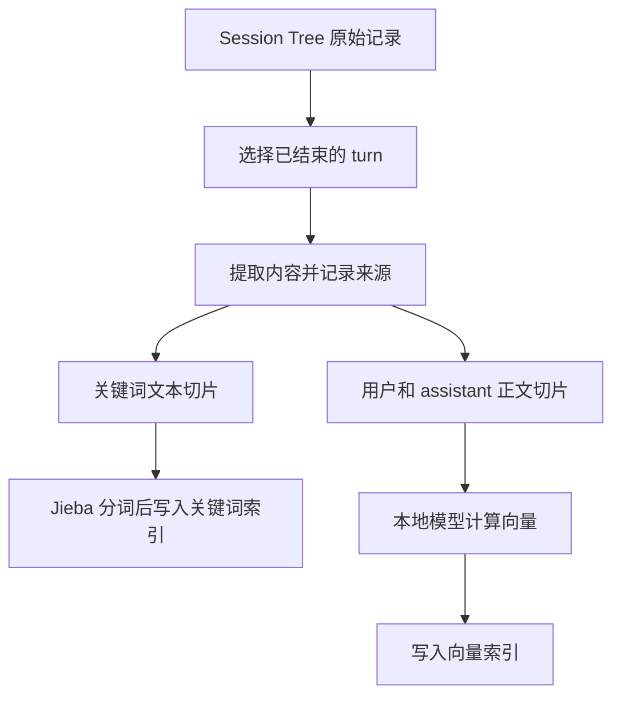

# 项目记忆是怎样被搜索到的

开发一个项目时，很多信息只存在于对话里：为什么选了某种方案，哪个尝试失败过，用户纠正过什么，以及某次工具执行究竟返回了什么。

过了一段时间，当前对话里可能已经没有这些内容了。此时，agent 需要能够回答“之前为什么这样做”，并找到当时的记录。

Thread 把这个过程称为项目记忆召回。“召回”在这里就是找回相关历史。它由两个工具配合完成：`session_search` 先寻找相关的一轮对话，`session_read` 再读取这一轮的原文。

本文从历史记录开始，逐步解释搜索使用的技术，以及一段对话怎样变得可搜索。工具的参数和完整返回示例放在另一篇[两个 Session 工具的使用说明](./session-tools.md)中。

## 先认识历史记录里的几个单位

一个项目有一棵 Session Tree，保存这个项目的对话历史和分支关系。用户执行 `/new` 时，会创建新的 session；之前的 session 仍然留在同一棵树里。

一个 session 中可以有很多个 turn。一个 turn 对应一轮交互：从用户提交请求开始，到 agent 完成、失败或被中断为止。这一轮中可以发生多次模型调用和工具执行。

turn 里面还有更细的记录，叫作 entry。每个 entry 只属于一个 turn。下面是一轮“修复登录失败”可能留下的记录：

| 记录 | 保存的内容 |
| --- | --- |
| 第一个 entry | 用户提出“修复登录失败” |
| 第二个 entry | assistant 的消息，其中包含读取文件的工具调用 |
| 第三个 entry | 工具实际执行的名称和参数 |
| 第四个 entry | 工具返回的文件内容 |
| 第五个 entry | assistant 说明修复结果 |

这些记录写入 Session Tree 的事件日志。程序读取日志，就能还原各个 session、turn、entry，以及它们之间的关系。

Thread 还有一份跨项目的全局记忆，用来保存稳定的用户偏好和可跨项目使用的信息。它有独立的保存和使用方式，见[全局记忆与 Dreamer](./global-memory-architecture.md)。本文介绍的搜索只处理当前项目的 Session Tree。

## 保存了历史，为什么还要建立索引

假设项目已经积累了几千轮对话。每次提问都从头阅读这些记录，再临时计算哪些内容相关，会重复做很多工作。

“建立索引”就是提前把历史整理成适合查找的结构。一本书在末尾列出“某个词出现在哪几页”，也是同样的思路：先准备查找线索，使用时再顺着线索找到原文。

Thread 准备两份索引。一份帮助查找关键词，另一份帮助查找意思相近的文字。它们都保存片段与原始 entry、turn 的对应关系。

原始记录继续保存在 Session Tree。索引可以从历史重新生成；索引损坏后重建，不需要改写历史，也不需要迁移已经保存的对话。

## 三种查找方式怎样配合

开发对话里既有精确的名字，也有自然语言。它们适合不同的查找方式。

例如，`E_HISTORY_271` 是一个错误码，最好直接找到它出现的位置。而“撤销以后旧对话还在吗”是一个意思，同一件事在历史中可能使用完全不同的措辞。

Thread 因此组合使用字面匹配、关键词检索和语义检索。

### 字面匹配：寻找写出来的那段文字

如果查询是 `src/history/records.ts`，字面匹配会检查提取出的文本中是否包含这段完整字符串。当前匹配忽略大小写。

这种方式适合路径、函数名和错误码。它直接检查文本，不需要运行模型；即使索引暂时不可用，也可以继续提供这种查找能力。

### 关键词检索：先认出词，再判断匹配程度

中文通常没有用空格分隔词语，所以需要先识别一句话中的词。Thread 使用 Jieba 来完成这件事，并对字母做小写处理。

分词后的内容交给 zvec 保存和查询。zvec 是嵌入 Thread 运行的本地搜索库，它负责维护这份关键词索引。

例如，查询“历史日志”，可以通过其中的词找到“会话历史采用追加日志”这样的内容。查询与原文不必是同一段连续的字符串。

找到含有查询词的片段之后，还需要决定谁更靠前。这里使用 BM25，一种常用的关键词评分方法。它会考虑词在片段中的出现情况、词在整份索引中的常见程度，以及片段的长度。

这让搜索有机会把重点讨论某件事的短段落排在前面。长日志虽然文字多，其中偶尔出现的几个词也要经过同样的评分。

当前实现通过 zvec 的 `matchString` 提交查询，并要求同一条查询分出的词一起匹配，也就是 `AND`。这样可以减少长句中常见词带来的无关结果。`queries[]` 中的不同查询分别执行，结果再合并，所以仍然可以提供几种不同的表述。

### 语义检索：为意思相近的文字建立联系

假设历史原文是：

> rewind 只移动当前路径的末端，旧分支仍然保留。

而用户现在问的是：

> 撤销之后，还能找回之前那条对话路线吗？

两句话表达了相关的意思，但共享的词可能很少。语义检索用来补充这种情况。

它使用一个 embedding 模型，把一段文字转换成一组数字。这组数字叫作向量。模型训练的目标之一，是让相关的查询和正文得到更接近的向量。搜索时便可以通过比较向量，找到措辞不同但可能相关的内容。

相近只说明值得进一步阅读。模型也可能把不同的事情判断为相近，所以搜索结果仍然需要原文来确认。

## 我们选用了什么模型，谁负责运行它

Thread 固定使用 **`Xenova/multilingual-e5-small` 的 Q8 版本**。这是一个支持中文、英文等多种语言的文本向量模型，[模型发布页](https://huggingface.co/Xenova/multilingual-e5-small)提供了原始 E5 模型的 ONNX 格式权重。

选择它，是因为项目对话中经常混合中文、英文和代码名称，而我们希望在普通 CPU 上运行，并让各个项目复用同一份模型。它负责从文字中提供语义线索，路径和错误码等精确内容继续由关键词和字面匹配补充。

这里有三个名字，需要分别理解。

**模型权重**保存模型已经学到的参数。ONNX 是保存模型计算过程和参数的一种格式。Q8 指使用了 8 位量化的版本，用较低精度的表示缩小模型；计算结果会有一定的数值差异。

**ONNX Runtime**负责在本机执行这个模型。Thread 使用它的 CPU 推理能力，设定两个推理线程，每批最多处理四段文本。

**Tokenizer**负责把文字转换成模型认识的编号。模型处理的基本单位叫 token，它可能是一个字、一个词，也可能只是词的一部分。因此，480 tokens 不等于 480 个汉字。Thread 使用 `@huggingface/tokenizers`，读取这个固定模型配套的分词文件。

Tokenizer 和前面提到的 Jieba 分工不同：Jieba 为关键词匹配识别词语，模型 tokenizer 为模型生成输入编号。

### 一段文字怎样变成 384 个数字

以历史正文为例，处理从加上 `passage: ` 前缀开始。查询则使用 `query: ` 前缀。这是 E5 用来区分“要寻找的问题”和“供检索的正文”的输入约定，中文输入也使用相同的英文前缀。原始模型的[使用说明](https://huggingface.co/intfloat/multilingual-e5-small)给出了这种方式。

Tokenizer 随后把文字编码为 token 编号，交给本地模型。模型会为各个 token 产生数值表示。

为了得到整个片段的表示，Thread 对有效位置的输出取平均。批量处理时，短文本会补齐长度；这些补齐的位置不计入平均。代码通过 attention mask 标识有效位置，这一步通常叫作平均池化。

最后，把结果调整为长度为 1 的向量。这叫作归一化，目的是让后续比较主要关注向量方向。每个片段最终得到 384 个浮点数。

原文片段也会一同保存，供结果展示和原文定位使用。

### zvec 在这个过程中做什么

[zvec](https://github.com/alibaba/zvec) 是嵌入应用程序中的搜索存储组件。Thread 通过 JavaScript 包 `@zvec/zvec` 使用它，保存关键词索引和已经计算好的向量，并执行查询。

在当前实现里，向量由 Thread 的本地模型计算，然后交给 zvec。模型文件准备、模型运行、历史文本提取和最终结果合并，都由 Thread 自己负责。

向量查询使用余弦距离，可以理解为比较两个向量的方向是否接近。索引类型选择 `FLAT`，也就是直接比较已存储的向量。这种方式容易理解，也没有近似搜索带来的额外误差，但计算量会随片段数量增长。它并不保证模型对文字含义的判断一定正确。

## 一条历史记录变得可搜索，要经过什么

整个过程可以先看这张图，再逐步往下读：



### 先选择历史，再提取内容

搜索考虑所有已结束的 turn，包括完成、失败和中断的尝试。其他 session、rewind 保留的分支也在范围内。正在运行的 turn 暂不参与，以免正在产生的内容影响本轮搜索。

一个 entry 可能同时含有正文、thinking 或工具调用。程序会按内容块提取文字，为每块内容记录类型，再决定它进入哪种索引。

| 内容 | 关键词索引 | 向量索引 |
| --- | --- | --- |
| 用户正文、assistant 正文 | 保存 | 保存 |
| thinking | 保存 | 不保存 |
| 工具名称、实际参数、工具结果 | 保存 | 不保存 |
| 图片 | 只保存 `[image]` 标记 | 不保存 |

用户和 assistant 的正文通常更接近对话正在讨论的事情。工具日志可能很长，因此只提供关键词查找，避免它们大量占用向量计算和语义结果的位置。

工具调用有时既出现在 assistant 消息中，又有单独的执行记录。已有执行记录时，程序采用实际执行的参数，避免把同一次调用重复提取。

另有两类内容会跳过。第一类是 `session_search` 和 `session_read` 的调用及返回内容，否则上次搜到的旧文字又会作为新证据被搜到。第二类是 compaction 记录中的摘要和历史副本。

Compaction 是为了缩短送给对话模型的上下文而整理历史。Session Tree 仍保留此前的原始记录，所以搜索原来的 entry 就可以了。这些提取规则只影响搜索，原始事件日志继续保留。

### 长内容需要切成较小的片段

一段工具输出可能有几万字，直接把它当成一个结果既难以排序，也难以展示。语义模型本身也有输入长度限制，所以两种索引都会切片。

关键词片段最多 2,000 字符。语义片段按照模型 tokenizer 切分，最多 480 tokens，为前缀和特殊 token 留出空间；模型的总输入限制是 512 tokens。

切分时尽量在段落之间断开。对于需要连续切分的长文本，关键词片段通常重叠约 200 字符，语义片段通常重叠约 48 tokens，让跨越切口的意思仍有机会被一起看到。短文本不需要为了重叠而重复生成片段。

关键词切片和语义切片分别进行，所以它们的边界未必相同。模型 tokenizer 按 token 数量工作，关键词切片按文本长度工作。

### 每个片段都带着回到原文的线索

片段保存 `sessionId`、`turnId`、`entryId`，以及 `kind`。其中 `kind` 表示用户正文、assistant 正文、thinking、工具调用、工具结果或图片标记。

它还保存源文本块中的起止位置。代码中的位置按 JavaScript 字符串使用的 UTF-16 单位计算；一个 emoji 可能占两个单位。切分时会避免从这种字符的中间断开。

片段 ID 根据来源和起止位置生成，同一内容再次处理时能够得到稳定的身份。这些信息让搜索找到片段后，可以继续定位到它属于哪一轮、哪条记录。

### 写入成功后，再记下完成进度

每个项目有两个 zvec collection。这里的 collection 可以理解为一组一起保存、一起查询的记录：一个存关键词片段，另一个存语义片段及向量。

Thread 按 turn 更新它们。同一 turn 如果上次只写了一部分，会先清理该次尝试留下的片段，再重新写入。写入时检查每条记录的返回状态，确认持久化成功后，才在进度清单里记下这个 turn 已完成。

进度清单还保存项目身份、文本处理版本、模型版本，以及各 turn 已处理内容的摘要值。这个摘要值是由内容计算出的指纹，用来判断能否复用已有结果。

因此，重启时可以继续补齐缺失的 turn，已经完整保存的向量不必重新计算。被中断的那个 turn 如果尚未提交完成进度，则会重新处理。

## 查询到来时，怎样决定返回哪些 turn

查询首先会去掉首尾空白和重复项。然后，Thread 检查是否有刚结束、尚未加入关键词索引的 turn，先补齐这一部分。

字面匹配直接检查提取出的文本。BM25 从关键词索引里寻找相关片段。模型可用时，语义查询会计算查询向量，在已经完成的向量索引里查找。

每条查询的 BM25 和向量检索各取最多 100 个候选片段。这是内部候选数量，和工具最终返回多少条结果是两回事。

接下来，程序先在各自的结果中按 turn 去重。某一轮即使命中了很多片段，也只在这一份排序里占一个位置。

两份排序随后合并。这里使用 RRF，中文可以理解为“根据名次合并结果”：某个 turn 在一份结果中排得越靠前，就得到越多贡献；在多份结果中都靠前，会得到更多贡献。它使用名次，是因为 BM25 分数和向量相似度原本不是同一种刻度。

当前两种检索使用相同权重。每份排序给第 `r` 名的贡献是 `1 / (60 + r)`，名次从 1 开始。多个查询也分别参与这个过程。

完整字面命中的 turn 优先展示。在相同优先级下，按合并后的分数排序；同分时，开始时间较新的 turn 靠前。

最终返回的单位始终是 turn。每个 turn 展示一段相关原文，附上这段原文的 `entryId` 和 `kind`。展示片段最多取 320 个字符串单位，并把换行等空白合并，方便浏览；更完整的文字通过 `session_read` 读取。

## 索引什么时候更新

当前进程第一次使用搜索时，Thread 才启用索引维护。它先补齐关键词索引，然后在后台准备模型并处理历史向量。刚启动 Thread、还没有使用搜索时，不会因为这套功能自动下载模型。

模型尚未准备好时，关键词和字面搜索已经可以提供结果。模型就绪后，也可以先搜索已经完成向量计算的部分历史，剩余内容继续在后台处理。

启用过搜索之后，新 turn 结束时会触发后台增量更新。每次搜索前仍会检查关键词索引是否缺少内容，因此用户不需要自己判断后台任务是否已经赶上。

不过，两种索引的完成时间可能不同：新结束的 turn 可以先被关键词找到，等向量生成后再参与语义检索。结果中的覆盖数量会说明当前完成到了哪里。

rewind 和 session 切换只改变当前路径，不需要重新计算这些文本的索引。结果属于当前路径、历史分支还是其他 session，会根据查询时的 Session Tree 判断。

## 模型未就绪或出现故障时

模型下载失败或加载失败时，搜索会说明原因，继续提供可用的关键词结果。修复下载条件后，可以重启 Thread，让模型准备重新尝试；当前进程不会在每次搜索时反复下载。

如果只是某一次查询的模型输入出了问题，例如超过模型长度限制，这次查询会使用已有的关键词结果，后续正常查询仍可尝试语义搜索。

如果 zvec 本身不可用，搜索会退回到同一份提取文本上的字面匹配，并明确告知。它的匹配能力有限，但 Session Tree 的历史保存和原文读取仍然独立工作。

打开索引时，如果发现索引损坏或文本处理版本不兼容，程序会重建相应数据。模型版本变化只需要重建向量部分。

取消请求会结束本次搜索，不再把取消当作错误去重试其他搜索方式。退出 Thread 时，会取消下载和后台任务，收尾索引操作并释放模型。索引清理失败不应阻止历史日志正常关闭。

## 模型文件、项目索引和配置放在哪里

`THREAD_HOME` 是 Thread 的用户数据目录。没有设置这个环境变量时，它默认是用户主目录里的 `.thread`。

项目记录与索引分别位于：

```text
${THREAD_HOME}/projects/<projectId>/session-tree/events.jsonl
${THREAD_HOME}/projects/<projectId>/session-search/keyword/
${THREAD_HOME}/projects/<projectId>/session-search/semantic/
${THREAD_HOME}/projects/<projectId>/session-search/manifest.json
```

模型文件则由所有项目共用。下面的 `revision` 是模型仓库中的固定版本标识，完整值列在文末：

```text
${THREAD_HOME}/models/multilingual-e5-small/<revision>/
```

首次需要时，会下载模型和两个 tokenizer 文件，总计约 135 MB。程序通过下载锁协调多个项目，用临时文件接收下载，并校验文件大小和 SHA-256。SHA-256 是文件内容的指纹，用来确认下载的字节与预期一致。

完整缓存可以离线使用。需要更换下载源时，可以设置 `HF_ENDPOINT`；下载的模型版本和校验要求仍然相同。

语义检索默认开启。如果希望只使用关键词和字面匹配，可以在 Thread 配置文件中设置：

```json
{
  "search": {
    "semantic": false
  }
}
```

关闭后，这个服务不准备或运行 embedding 模型。已有的模型缓存可以继续留给其他项目使用。

文本提取、分词、向量计算和检索都在本机完成。首次准备模型会访问下载源。搜索结果会作为工具结果交给当前 agent；这些结果是否进一步发送到远端，取决于主 agent 使用的对话模型。

## 本地运行与单文件发布

模型在一个专用的隐藏子进程中运行。这样，后台生成向量时可以让主进程继续处理交互。当前批次完成后，查询任务优先于下一批历史索引任务。

之所以采用子进程，是因为本项目在 Windows、Bun 1.3.14 上验证时，销毁加载过 ONNX 的 worker thread 会触发原生模块退出崩溃，包括先释放模型 session 的情况。子进程把模型运行和退出过程分开处理。

开发运行通过 Bun 启动模型入口。单文件产物通过内部通信入口启动同一个可执行文件，因此使用发布产物时，无需另外安装 Bun、Node 或 Python。父进程断开后，模型子进程会退出。

zvec、Jieba 字典和 ONNX 所需的原生库随程序一起打包，运行时释放到 `${THREAD_HOME}/native` 下按版本区分的目录。模型文件单独下载。

发布流程覆盖 Windows、Linux、macOS 的 x64 和 arm64，共六个平台。每个平台都配置了真实模型检索和独立目录运行检查。

## 需要核对实现时，从这里开始

当前固定依赖如下。这里的 zvec 版本指 JavaScript 包版本：

| 依赖 | 版本 | 在 Thread 中负责什么 |
| --- | --- | --- |
| `@zvec/zvec` | `0.7.1` | 保存索引、执行关键词和向量查询 |
| `onnxruntime-node` | `1.24.3` | 在本机执行 ONNX 模型 |
| `@huggingface/tokenizers` | `0.1.3` | 按模型词表编码文本 |

模型仓库为 `Xenova/multilingual-e5-small`，文件为 `onnx/model_quantized.onnx`，固定 revision 是：

```text
761b726dd34fb83930e26aab4e9ac3899aa1fa78
```

版本、文件大小和 SHA-256 都定义在 [model-assets.ts](../src/session-recall/model-assets.ts)。Thread 当前只支持这一套固定模型。

整体流程在 [service.ts](../src/session-recall/service.ts)。工具和命令通过 `ThreadApp.recall` 使用同一个 `SessionRecallService`，旧的 `SessionSearchService` 已移除。

文本提取和关键词切片在 [documents.ts](../src/session-recall/documents.ts)，原文读取在 [reader.ts](../src/session-recall/reader.ts)。

[zvec-index.ts](../src/session-recall/zvec-index.ts) 管理索引与进度。当前 Node 绑定没有单独的 flush 方法，也就是没有“立即把修改刷新到磁盘”的独立操作。因此每个 turn 写入后会关闭并重新打开 collection，确认持久化后才提交进度。

[embedding.ts](../src/session-recall/embedding.ts) 管理模型子进程和任务顺序，[embedding-worker.ts](../src/session-recall/embedding-worker.ts) 处理模型分词、推理和向量计算。

原生文件的打包与释放分别在 [recall-bundle.ts](../scripts/recall-bundle.ts) 和 [native-assets.ts](../src/session-recall/native-assets.ts)。

## 怎样验证这套流程

普通回归测试使用可控制的 embedding 测试实现，不下载真实模型。它们检查历史分支、内容过滤、增量更新、失败恢复和取消等行为：

```bash
bun run check
bun test test --timeout 30000
```

真实模型验证单独运行。它会使用固定的合成开发对话，检查改写查询、精确标识符、参考向量以及长文本切分，并输出索引耗时、查询延迟和进程内存：

```bash
bun run test:recall
```

发布产物还需要在没有项目依赖目录的环境里运行。以下命令会编译程序，再把它复制到 checkout 之外的临时目录，验证中文路径、自动下载、离线重启和正常退出：

```bash
bun run build:standalone
bun run test:standalone-recall release/thread.exe
```

在 Linux 和 macOS 上，最后一个路径改为 `release/thread`。测试使用合成历史，不读取真实项目对话；下载检查通过临时的本地 HTTP 源提供固定模型文件，然后关闭该源，验证离线复用。

2026-09-05 的 Windows x64 验证中，类型检查、普通构建、单文件构建和 85 项回归测试通过。20-turn 固定样本的结果如下：

| 项目 | 实测结果 |
| --- | --- |
| 10 个改写查询 | 9 个在前五条找到指定 turn |
| 3 个精确标识符 | 全部排在第一条 |
| 已有模型缓存时首次索引 | 约 8.65 秒 |
| 查询中位耗时 | 约 5.4 毫秒 |
| 查询后父进程 RSS | 约 343 MiB |
| 查询后模型子进程 RSS | 约 528 MiB |

RSS 表示进程当时驻留在物理内存中的页面大小。两者相加约 871 MiB，其中共享页可能重复计算；这个值也不是峰值。模型下载只有约 135 MB，并不意味着运行时只占用这么多内存。

这些数据来自小型固定样本，用于确认流程和基本质量，不能作为大型项目的耗时或内存上限。Windows 单文件的首次下载、中文路径和离线重启已在本机通过；其他五个平台配置了发布验证，此记录不代表已经在本机实测它们。
